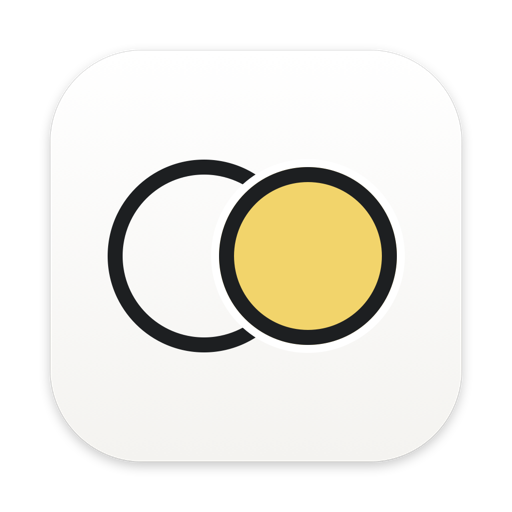
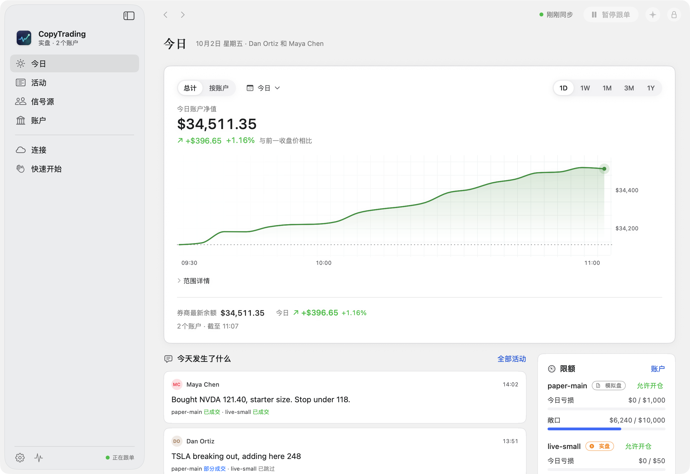
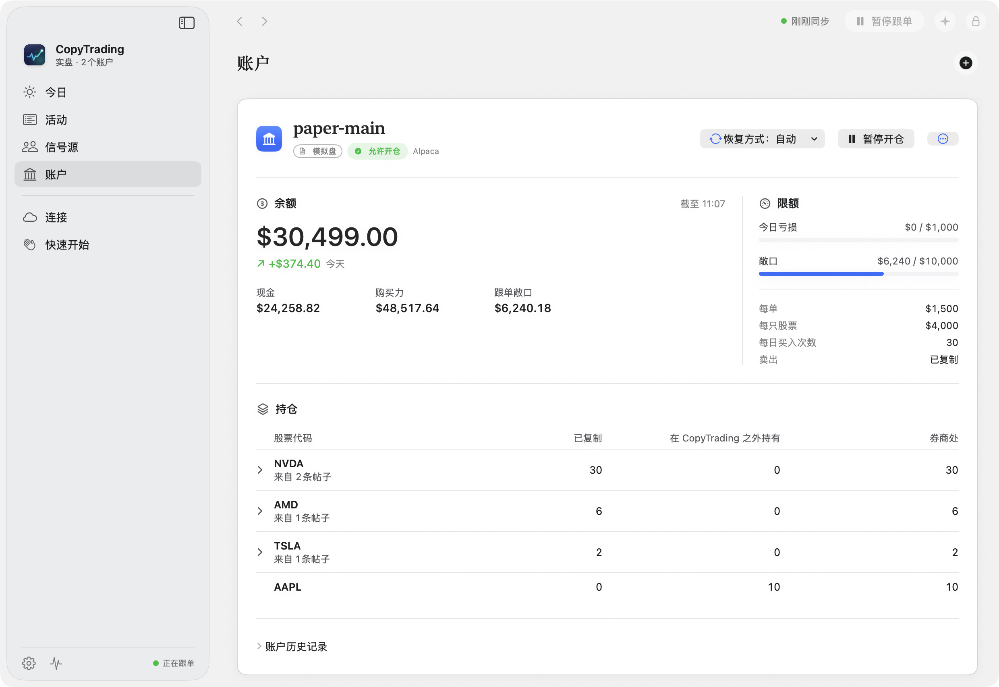
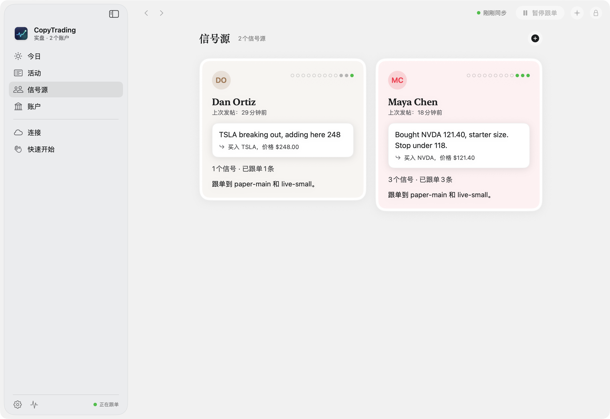
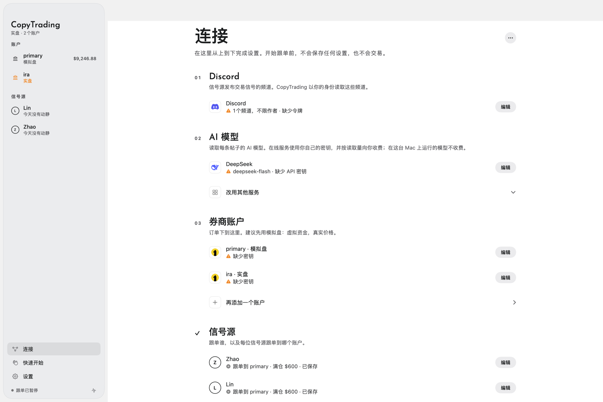
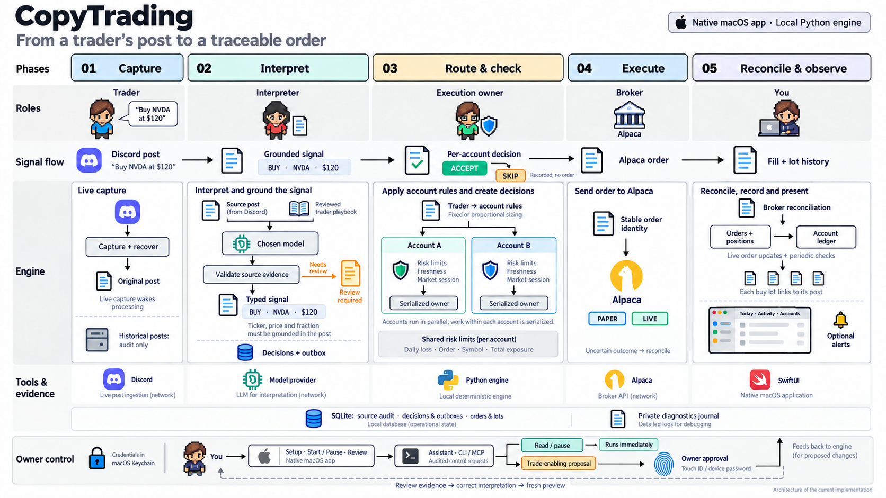

<p align="center">
  
</p>

<h1 align="center">CopyTrading</h1>

<p align="center">
  <em>跟单你信任的交易者，并始终在你设定的限额之内。</em>
</p>

<p align="center">
  <a href="https://github.com/YZXBiz/copytrading/actions/workflows/ci.yml?query=branch%3Amain"></a>
  <a href="https://coverage-badge.samuelcolvin.workers.dev/redirect/YZXBiz/copytrading"></a>
  <a href="https://github.com/YZXBiz/copytrading/releases"></a>
  
  <a href="LICENSE"></a>
</p>

<p align="center">
  <a href="https://github.com/YZXBiz/copytrading/releases/download/v0.1.0-alpha.3/CopyTrading-0.1.0-alpha.3.dmg"></a>
</p>

<p align="center">
  <a href="README.md">English</a> · <strong>简体中文</strong>
</p>

<p align="center">
  <strong>不构成投资建议。</strong>CopyTrading 是软件，不是投资顾问。交易可能亏损，你需要对它下的每一笔订单负责。
</p>

CopyTrading 是一款原生 macOS 应用。它读取交易者在 Discord 上发布的股票信号，把每条信号转换成明确的订单，按你设定的限额检查，再通过你的 Alpaca 账户下单。一切都在你的 Mac 上运行。

> [!WARNING]
> **不构成投资建议。** 本项目中的任何内容，包括应用、助手以及你所跟随的交易者，都不是投资、财务、法律或税务建议，也没有人在此推荐任何交易。交易可能让你损失部分或全部资金。跟随谁、设置什么限额都由你自己决定，你需要对账户中下的每一笔订单负责。本软件按“现状”提供，不附带任何担保（[MIT 许可证](LICENSE)）。
>
> **开发者预览版。** CopyTrading 尚未通过实盘交易的资格验证。请先使用 Alpaca 模拟盘账户；已验证和尚未验证的内容见 [validation](docs/validation.md)。

<p align="center">
  <a href="docs/assets/zh/today.png"></a>
</p>

<details>
<summary>更多截图</summary>
<br>
<table>
  <tr>
    <td width="33%"><a href="docs/assets/zh/accounts.png"></a></td>
    <td width="33%"><a href="docs/assets/zh/people.png"></a></td>
    <td width="33%"><a href="docs/assets/zh/connections.png"></a></td>
  </tr>
  <tr>
    <td align="center"><sub><b>账户</b>：每笔持仓都能追溯到买入它的帖子</sub></td>
    <td align="center"><sub><b>信号源</b>：你跟随谁，表现如何</sub></td>
    <td align="center"><sub><b>连接</b>：Discord、AI 模型、提醒</sub></td>
  </tr>
</table>
</details>

## 主要功能

- **帖子变成明确的订单。** 由你选择的 AI 模型读取每条帖子；每个股票代码、价格和比例都必须出现在帖子原文里，所以模型无法凭空编造数字。
- **按账户设定限额。** 每一笔跟单买入前都会检查每日亏损、单笔、单只股票和总敞口限额。新账户默认不开新仓。
- **多位信号源，多个账户。** 每一对“信号源到账户”的连接都有自己的仓位规则，模拟盘和实盘账户并排显示。
- **每笔持仓都能追溯到它的帖子。** 每笔跟单买入都保存为一个仓位批次，注明买入它的帖子；任意一批都可以单独卖出。
- **助手无法自行交易。** 按 ⌘J 提问，它根据你真实的帖子和账户回答；任何可能下单的操作都要等你用 Touch ID 批准。
- **隐私优先。** 密钥保存在 macOS 钥匙串中；应用会与 Discord、你的 AI 模型服务商和你的券商通信；开启提醒时还会连接 Telegram，检查更新时会连接 GitHub。

支持十几家云端模型服务、通过 Ollama 运行的本地模型，以及任何兼容 OpenAI 接口的地址；界面提供 English 和简体中文。

## 安装

需要一台运行 macOS 26 或更高版本的 Apple 芯片 Mac。

1. **[下载 macOS 版 CopyTrading](https://github.com/YZXBiz/copytrading/releases/download/v0.1.0-alpha.3/CopyTrading-0.1.0-alpha.3.dmg)**（55 MB）。
2. 打开 DMG，把 **CopyTrading** 拖进 **应用程序**。
3. 打开 CopyTrading。预览版尚未经过 Apple 公证，所以第一次打开时 macOS 会阻止它：前往 **系统设置 → 隐私与安全性**，选择 **仍要打开**。只需操作这一次。

每个版本都附有 SHA-256 校验和，如何校验下载文件见 [releases](docs/releases.md)。

**或者从源码构建：** 需要 [uv](https://docs.astral.sh/uv/) 和 Xcode 命令行工具。

```sh
git clone https://github.com/YZXBiz/copytrading.git
cd copytrading
make app
```

`make app` 会检查你的 Mac、下载固定版本并经过校验的运行时、构建应用并打开它。第一次构建需要几分钟。

## 快速上手

应用打开后停在 **快速开始**，它的清单会随着你的填写自动打勾。在你点击 **开始跟单** 之前，不会保存任何内容，也不会下任何单。

所有设置都在 **连接** 中从上到下完成：

1. **Discord**：要读取的频道，以及你的 Discord 令牌。
2. **AI 模型**：读取帖子的模型，以及它的 API 密钥。
3. **券商账户**：一个 Alpaca **模拟盘** 账户。
4. **信号源**：点击 **从频道学习**，检查它起草的操作指南，并设置每个账户投入多少。
5. 点击 **开始跟单**。它会先检查每个连接，全部通过后才开始。

每个需要密钥或 ID 的字段旁都有 **这个去哪里找？** 链接。准备好之后，到 **账户** 中启用开仓，然后在 **活动** 里看到第一条帖子。

## 工作原理

<p align="center">
  <a href="docs/assets/copytrading-workflow.png"></a>
  <br>
  <sub><a href="docs/assets/copytrading-workflow.png">查看完整尺寸高清图</a></sub>
</p>

一个 SwiftUI 应用负责监管一个本地 Python 引擎。引擎掌管所有决策，把它们保存在 SQLite 中，并在崩溃或休眠之后与券商对账；应用关闭期间过期的信号，绝不会变成一笔迟到的订单。详情见 [architecture](docs/architecture.md)，设计缘由记录在 [ADR](docs/adr/) 中（均为英文）。

## 命令行与编程助手

`copytrading` 命令行工具和 MCP 服务器让你、脚本或编程助手读取正在运行的应用，并可以暂停它。任何可能触发交易的操作都会变成一条提议，要在应用里用 Touch ID 批准。

```console
$ copytrading status
Engine      Ready
Processing  Running
Accounts    paper-main  entries enabled, recovery manual

$ copytrading accounts resume paper-main
Waiting for approval in CopyTrading: proposal p-4e1a9c, expires 16:42.
```

命令、权限等级和威胁模型见 [agent control](docs/agent-control.md)（英文）。

引擎也可以不依赖应用，独立运行在 Mac 或 Linux 服务器上，这样即使 Mac 休眠，跟单也不会中断。`copytrading-server` 从 `copytrading.toml` 文件读取设置，从环境变量读取密钥，并附带 Docker 镜像。详见 [Run the engine without the app](docs/server.md)（英文）。

## 文档

目前文档为英文。

| | |
| --- | --- |
| [PRD](docs/PRD.md) | CopyTrading 面向谁，必须做到什么 |
| [Architecture](docs/architecture.md) · [Engine structure](docs/engine-structure.md) · [ADRs](docs/adr/) | 各部分如何配合，以及为什么 |
| [Agent control](docs/agent-control.md) · [Server](docs/server.md) | `copytrading` 命令行和 MCP 服务器，以及不依赖应用运行引擎 |
| [Acceptance](docs/acceptance.md) · [Validation](docs/validation.md) | “可用”的定义，以及目前的证据 |
| [Operations](docs/operations.md) · [Releases](docs/releases.md) | 开发命令和预览版安装包 |
| [Changelog](CHANGELOG.md) | 每个版本的更新内容 |

## 参与贡献

先运行 `make doctor` 检查你的 Mac，再用 `make check` 运行引擎的 1,200 多个测试、Ruff 和 Ty。原生应用的检查和约定见 [CONTRIBUTING.md](CONTRIBUTING.md)。使用问题请到 [Discussions](https://github.com/YZXBiz/copytrading/discussions) 提问，缺陷请用 [issue 表单](https://github.com/YZXBiz/copytrading/issues/new/choose) 报告，安全漏洞请按 [SECURITY.md](SECURITY.md) 私下报告。

## 许可证

[MIT](LICENSE)
