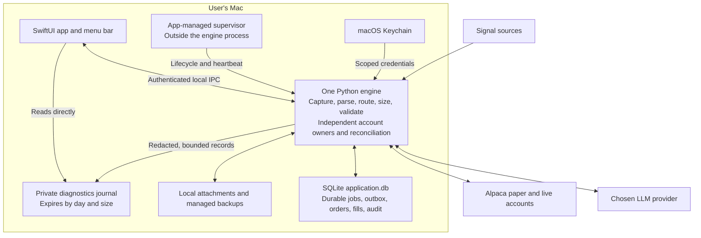

# CopyTrading — product requirements

Status: product scope confirmed September 25, 2026. The repository contains SwiftUI, a shared Python engine, operational SQLite, Discord/model/Alpaca adapters, and app-managed local diagnostics. Local build and integration checks pass; full app-to-broker operation and release gates remain unverified. This PRD states target behavior; code presence and an unsigned local build do not complete a desktop milestone.

This is the single product plan: requirements, architecture direction, release evidence, and delivery milestones. [Current architecture](architecture.md), [operations](operations.md), and [validation evidence](validation.md) describe the app migration and its current evidence.

## 1. Product and audience

An open-source macOS application that people without coding experience can install, configure, and operate. It captures signals from multiple gurus, stores them durably, interprets and validates them, routes them to selected brokerage accounts, submits permitted orders, reconciles results, and makes the whole process observable.

Zhao is an example profile. Each installation uses the operator's own source access, model credentials, and brokerage accounts. Users should complete normal setup and operation without a terminal, Python, JSON editing, or container administration.

The first release supports Alpaca paper and live accounts, multiple gurus, and multiple accounts. Windows/Linux, remote hosting, other brokers, image interpretation, and multi-host high availability are later increments. Existing integrations remain the starting point; a new source convention must fit a supported profile or require an explicit extension.

## 2. Confirmed first-release requirements

| Area | Required behavior |
| --- | --- |
| Installation | One macOS app installs and manages its required runtime. A separate runtime application is not an accepted setup requirement. |
| Account support | Paper and live accounts together, with visible environment/identity and separate credentials, state, and permissions. |
| Routing | Many gurus to many accounts. Each guru-account connection has its own sizing settings and outcome. |
| Failure isolation | Healthy accounts proceed independently when another destination is disconnected, underfunded, paused, or rejected by policy. |
| Process failure | One shared Python engine is acceptable. A process crash can interrupt all accounts; a supervisor outside the engine manages restart, followed by reconciliation and each account's recovery preference. |
| Sizing | Fixed dollars per entry or proportional sizing against a configured full-position budget, selected per guru-account connection. |
| Missing fraction | Use an explicitly configured connection default; otherwise require review and submit no automated order. |
| Existing investments | Support existing holdings and manual trading. External holdings stay distinct from app-owned lots. |
| Ownership conflict | Pause the affected symbol/account and let the operator resolve ambiguous ownership. Other trading continues only where account-wide checks pass. |
| Source setup | Prepared profiles plus a guided builder using examples and plain-language conventions, with previews and user review before activation. |
| Signal formats | Text interpretation first. Preserve accessible attachment evidence and flag image-dependent messages for review. |
| Human review | Allow corrected interpretations and separately confirmed manual orders after fresh price, risk, ownership, and duplicate-order checks. |
| Background operation | Closing the window keeps the engine running. Provide menu-bar status and a separate Stop engine control. |
| Recovery | Setting per account, manual resume by default. Opted-in accounts resume only after successful checks; deliberate pauses remain paused. |
| Publisher trust | Credentials and operational data remain local. No publisher credential/data backend or remote-control mechanism. |
| Account connection | Guided local API-key/secret setup is acceptable. A publisher-operated OAuth server is not required. |
| App authentication | Unlock once when opening the app. No repeated authentication for settings changes or individual orders. |
| Local diagnostics | Searchable, filterable diagnostics inside the app, readable while the engine is stopped; no diagnostics server or external backend. |
| Diagnostic capture | Full source-message and model request/response payloads by default, excluding secrets. Attempt to trace every workflow and destination; expose capture gaps. |
| Retention | Diagnostics expire under configurable age and disk limits. Trading evidence remains until explicit eligible archive/deletion; protect evidence needed by active positions, pending work, and reconciliation. |
| Updates | Notify and show release notes; install only when the user chooses, with compatibility and recovery checks. |
| Load targets | Benchmark 20 active sources, 10 connected accounts, 5 messages/second sustained, and bursts of 50/second. These are targets, not proven capacity. |

The current development APIs, schemas, and folder layout require no backward compatibility. Replace/delete obsolete code and files when the new design warrants it; do not add compatibility shims, dual writes, or legacy readers. Git history preserves the old implementation. This does not authorize resetting running deployments or account data. Future published releases need explicit update compatibility; unsupported state is refused with an explanation.

## 3. Operator experience

### Install and connect

The app is distributed through GitHub Releases, not the Mac App Store. It checks OS/CPU support, memory/disk, port conflicts, and existing installations. It installs/manages its native runtime components, explains resource use and OS permissions, and provides resumable progress and actionable failures. It reports ready only after capability checks pass. Signing, notarization, and artifact integrity remain distribution requirements; hosting the download on GitHub does not establish installer trust.

After unlocking, users connect sources, models, accounts, and notifications through guided forms. Tests display the actual connected identity and permissions. Broker forms show paper/live explicitly; their credentials and endpoints are distinct. New accounts start with execution disabled. Duplicate registration cannot create two independent owners of the same account.

Onboarding inventories existing positions and open orders. It establishes external holdings and outstanding activity without adopting them into app-owned lots, fabricating fills, or liquidating positions. Source authentication must be achievable by a noncoder; developer-only credential extraction is a packaging/onboarding blocker to resolve.

### Configure a guru and account destinations

Users press Learn from Channel: the model reads the channel's recent posts and drafts a playbook (how this guru writes buys, trims, exits, and names), a prefix, an exit basis, and example posts with what they mean. Users edit the draft; Validate runs the examples through the reader, and a mismatch blocks activation. Adding a guru never needs a code change. Prose steers interpretation but never bypasses grounding: every price, ticker, and fraction must be complete tokens of the post, and a company name resolves to a ticker only when a playbook line states it (ADR-0006).

A source profile owns interpretation: the playbook, prefix, examples, and exit basis. Each destination connection owns sizing. For example:

| Connection | Policy | Source says `1/6` | Source says `1/3` |
| --- | --- | --- | --- |
| Zhao → Account A | Fixed $500 | $500 budget | $500 budget |
| Zhao → Account B | Proportional; full position $3,000 | $500 budget | $1,000 budget |

Apply the fraction once. A missing proportional fraction uses only an explicit configured default. Actual permitted quantity remains subject to price, buying power, and account limits. “Sell half” is a separate exit-quantity rule whose original-versus-remaining basis must be explicit.

Preview shows source text, action, ticker, price, lot reference, per-account copied amount/quantity, and reasons for review or rejection. Identify model/provider/profile revision and clearly label simulated results. Preview and historical evaluation cannot submit orders.

### Enable and monitor

Before enabling, show the selected account's environment, identity, destinations, sizing, limits, session restrictions, and reconciliation status. One source event can succeed in Account A and be rejected in Account B. Display both results without promising simultaneous or all-or-nothing fills.

The activity timeline distinguishes capture, interpretation, review/ignore, execution decision, prepared intent, submission, broker acceptance, partial fill, fill, and cancellation. Notification acceptance is distinct from verified delivery. A healthy process is distinct from readiness to trade.

Describe problems in ordinary language: “Your model provider is limiting requests. 240 messages are waiting; the oldest is 45 seconds old. Expired signals will not create new automated orders.” Attach detailed logs/traces for investigation.

### Resolve ownership or a reviewed signal

If an account has 100 external shares and 50 app-owned shares of one stock, a manual sale does not reliably identify which internal allocation was sold. Pause that symbol/account, display evidence, and let the operator resolve allocation. Do not automatically deduct external shares first or distribute the change proportionally. Persist the resolution and reconcile it against actual broker quantity before resuming.

A user may correct a reviewed message, select an account, and request a fresh order preview. Explicit confirmation creates a distinct audited manual command linked to the source and correction. Validate current price/session, risk, ownership, prior orders/fills, and duplicate commands immediately before submission. A changed timestamp or Retry button must not turn an old signal into a new automated order.

An ownership correction is not itself a broker order. An order confirmation is an intentional action, not a second authentication prompt. Both rules fit the single-unlock requirement.

### Screens

| Screen | Purpose |
| --- | --- |
| Setup | Managed installation, connection forms, identities, readiness. |
| Overview | Per-account capability/status, incidents, backlog, exposure, pause/resume. |
| Sources | Prepared profiles, guided builder, examples, destinations, sizing, active revisions. |
| Accounts | Paper/live identity, external/app-owned positions, limits, recovery preferences. |
| Activity and review | Message-to-order evidence, ownership resolution, corrections, fresh preview/confirmation. |
| Connections | Local credentials, connection checks, permissions, model quotas. |
| Diagnostics | Native, searchable view of the private diagnostics journal: workflow stages, captured source posts, model requests and replies, and trading outcomes, correlated by workflow and trace identity. |
| System | Resource use, storage/retention, backup, user-controlled updates, support export, diagnostic health and capture gaps. |

Setup, trading controls, health summaries, the signal timeline, and diagnostics are native SwiftUI. A future Windows version may have a separate UI; the Python engine remains independent of SwiftUI.

## 4. Security and lifecycle

Credentials use macOS Keychain and narrowly scoped access for required runtime processes. Profiles and normal exports omit credentials. The diagnostics journal and support exports exclude API keys, authorization headers, and other secrets. Full source text and model request/response payloads are captured locally by default, so diagnostics are sensitive local data. Support export is explicit, redacted, and previewable; local full capture does not authorize external disclosure.

The publisher receives no brokerage credentials, private messages, trading history, or remote-control authority. Only user-configured sources, broker, LLM, and notification services receive necessary data. Explain model/cloud costs and outbound message processing during setup. Release/update requests contain no account secrets or activity payloads.

Diagnostics never leave the Mac and run no server: the engine writes an owner-only journal file, and the app reads it directly behind the app unlock. No diagnostics service listens on any port, and nothing reports usage outward.

App unlock protects operator access. It does not prove that a malicious installed program cannot misuse credentials it is allowed to read. Reviewable source, release provenance, verified artifact integrity, limited data flows, and user-controlled update installation are part of the trust design. Signing/notarization alone does not certify trustworthy application behavior. The product does not claim per-order MFA.

| Event | Required behavior |
| --- | --- |
| Open/close window | Authenticate once on opening; closing leaves authorized processing running with menu-bar status. |
| Pause new entries | Persist the pause for that account. Capture, reconciliation, and eligible copied exits continue. Skipped entries are not bulk-submitted on resume. |
| Stop engine | Stop admission, drain/checkpoint bounded work, and stop the engine. Explain that broker orders may remain active. |
| Reboot, crash, or sleep/wake | Recover durable state, preserve source timestamps, reconcile each account, and apply its recovery preference. Manual is default; automatic requires prior opt-in and successful checks. |
| Deliberate pause or ownership incident | Recovery does not clear it. The relevant user action/resolution is required. |
| Credentials unavailable after reboot | Show the blocked capability and wait for permitted access; never weaken secret protection to satisfy automatic resume. |
| Second instance | Attach to the installation's runtime or refuse clearly; never duplicate ownership of an account. |
| Update | User initiates installation; compatibility, coordinated stop, state preservation, and recovery checks apply. |
| Uninstall | Preserve data by default; explicit deletion is separate. Neither uninstall nor shutdown liquidates positions. |

An asleep/offline laptop cannot process signals or guarantee exits. Background operation requires an awake connected host. OS credential availability before first unlock is an M1 investigation, not a promise to bypass OS protection.

## 5. Architecture direction

The diagram below describes the approved target product. The [current architecture](architecture.md) describes the implementation and its present restrictions.

### Technology choices and validation boundary

| Responsibility | Approved direction | Boundary |
| --- | --- | --- |
| Desktop | SwiftUI app and menu bar | Native setup, controls, activity, and diagnostics; a separate Windows UI later is acceptable. |
| Runtime | Bundled Python engine with async I/O and focused internal modules; supervisor outside the engine | One engine process; account owners serialize their own execution. Restart is not permission to resume trading. |
| Operational persistence | SQLite `application.db`, durable jobs/outbox, local attachment files | Short atomic transactions and coordinated writes; broker/model calls outside transactions. No Kafka, PostgreSQL, MinIO, or Iceberg in the proposed default desktop runtime. |
| Secrets | macOS Keychain | Narrow process access; credentials excluded from telemetry and support bundles. |
| Diagnostics | Engine-written private journal of redacted JSON lines | Correlated workflow, trace, and destination identities; bounded labels and payloads; a bounded queue that counts drops; expiry by whole UTC day and by an owner-chosen size. No separate diagnostics process, server, or database. |
| Investigation and alerts | Native Diagnostics, health, and activity views; application health rules and external heartbeat supervision | Diagnostic failure is visible; alerts do not rely exclusively on the failed engine. Optional configured Telegram delivery is separate. |

The default design needs no Docker, Linux VM, publisher backend, diagnostics server, or separately installed monitoring application.

**App/control boundary:** the UI uses authenticated local IPC or an authenticated loopback API. It never directly writes service tables or calls the broker. Control owns configuration activation, command identities/status, lifecycle, secret references, and an operator read model using owner-defined audit/status contracts. Loopback binding alone is not authorization.

**Execution ownership:** one authoritative owner per stable broker account/environment, with isolated credentials, journal, positions, limits, queues, and recovery. Owners for different accounts may run concurrently inside one Python engine; ordinary destination failures remain local to that account. A shared process crash may interrupt every account. Supervised recovery reloads durable work, reconciles uncertain submissions, and respects each account's resume setting. The present single snapshot and global execution lock cannot simply be shared across accounts.

**Routing and identity:** persist destination selection and route/profile revisions at dispatch. A destination intent includes account/environment and source instruction identity. Duplicate active bindings cannot submit the same instruction twice to the same account. Retries retain identity and original timestamps; adding a destination later does not replay old signals automatically. Record independent per-account outcomes.

**Interpretation and policy:** profiles are validated data, separate from provider adapters. A compatible parsed result may serve several account routes; each route applies deterministic sizing and account-specific risk. A missing fraction is explicit, not silently replaced by full size. Existing/external holdings and app-owned lots have distinct attribution, with broker positions as quantity authority.

**Manual commands:** interpretation corrections retain the original evidence. A separately confirmed command has its own identity, selected account, current checks, and links to prior source/order activity. Repeated confirmation or timeout cannot duplicate it. Reconcile an existing uncertain automated/manual intent before any overlapping replacement.

**Configuration:** draft → validate/preview → immutable revision → coordinated activation → observed readiness. Scope pauses/restarts to affected components/accounts. A partial activation remains visible and blocks affected new entries. In-flight orders retain their original terms and referenced revisions. Credential rotation cannot silently bind an existing ledger to a different account.

**Reliability and volume:** persist accepted messages and intents before external side effects. Use durable claims, bounded workers/queues, source ordering where necessary, per-source fairness, and provider/account quotas. Reserve capacity for reconciliation and exits. Freshness checks apply before expensive processing and before automated submission. Capture gaps that cannot be recovered from the source remain visible.

**Storage and observability:** operational SQLite commits state transitions with their durable jobs/outbox and required audit evidence. This is a persistence and workflow redesign, not a drop-in database replacement. Retain the source, interpretation, relevant configuration revision, decisions, orders, and fills needed to explain each trade; analytical views can read this history without requiring an Iceberg service. Preserve evidence until explicit eligible archive/deletion, protecting active positions, pending work, and reconciliation. Attachments/backups live in managed local files.

Attempt diagnostic capture for every workflow and routed account, with stage timing and linked model/broker calls. Full message/model payloads are local by default, excluding secrets. The diagnostics journal expires automatically under configurable age and size limits; display its size and capture gaps, and support explicit export of the journal. Exact defaults remain engineering settings to validate. Trading audit is never sampled or dropped as telemetry.

Diagnostic capture/export is bounded and best-effort. If it fails, show degraded health and alert through an independent path where available; execution can continue only while operational commits, ownership, risk, and broker checks remain sound. Failure of required operational persistence blocks new submissions. Shared disk exhaustion may affect both stores and must not be treated as a harmless telemetry outage. Health checks use authoritative engine/account state and an external heartbeat, not only telemetry queries. Metrics have bounded labels; event IDs belong in audit records/traces. Notifications have filters, grouping, limits, and incident priority while the app retains every outcome.

**Recovery and backup:** restore verifies a consistent operational database and its referenced files in isolation, followed by account reconciliation before activation. Disposable diagnostics are separate from required trading recovery. Software rollback cannot rewind broker actions. Unsupported formats stop clearly; no silent reset or legacy compatibility layer is implied.

### Implementation and review standards

Apply `python-architecture`, `robust-python-reference`, and `swiftui-pro` throughout implementation and review. These are engineering constraints for the build, not a claim that the proposed desktop code already exists.

- **Python boundaries:** domain rules and application workflows own their contracts; SQLite, broker/model clients, local IPC, and telemetry are adapters. Wire concrete dependencies at startup. Keep sizing, retry, and ownership policy out of storage and transport code. Introduce repositories, units of work, and other abstractions only where a concrete responsibility or transaction boundary warrants them.
- **Types and invariants:** use named records, explicit state variants, immutable configuration revisions, and narrow interfaces. Validate external input at entry boundaries; serialize at transport/storage boundaries. Protect account identity, quantity conservation, order identity, and legal transitions through operations rather than unrestricted mutation.
- **Extensibility:** registered provider adapters satisfy one typed application-owned contract. Guru conventions remain profile data. Adding a model provider must not require provider-specific branches in trading policy; avoid speculative plugin systems for components with no demonstrated extension need.
- **SwiftUI ownership:** organize by feature, compose focused views, and keep trading logic and process management outside view bodies. Make observable UI state ownership explicit; use main-actor isolation for UI state and structured concurrency with defined cancellation/lifetimes. Keep blocking I/O off the UI executor. Check modern API availability against the chosen macOS deployment target, plus accessibility and navigation behavior.
- **Cross-process ownership:** define typed, versioned local commands/results and explicit resource lifetimes. The engine owns operational transactions; SwiftUI issues commands and reads projections. Cancellation or UI disconnection cannot imply a broker order was canceled or roll back a committed side effect.
- **Verification:** review dependency direction and type contracts; exercise real SQLite transactions, adapter contracts, process restart, cancellation, and embedded diagnostic access. Use properties for trading invariants and focused UI checks for observable behavior. State which failure each test proves; mock-only checks cannot establish runtime integration.

The boundary and policy/mechanism guidance draws on Sam Keen, *Clean Architecture with Python*, Chapter 1, “The onion architecture concept” (PDF pp. 34–35), and Patrick Viafore, *Robust Python*, Chapter 17, “Policy Versus Mechanisms” (PDF pp. 267–270). The rules above are this project's application of those principles; select further original passages and SwiftUI references for each concrete implementation task. Every added layer must have a named responsibility and a behavior that verifies its value.

## 6. Workload and acceptance evidence

“Accepted” means durable capture committed. Upstream events unavailable from the source are outside that boundary; report gaps. There is no universal exactly-once guarantee across independent external systems.

The agreed workload dimensions are **20 sources, 10 accounts, 5 incoming messages/second sustained, and bursts of 50/second**. Report message sizes/mix, source/model latency, quotas, route fan-out, instructions per message, machine specification, retention, and code revision. Model calls, account candidates, broker requests, and archived events are separate rates.

These are later acceptance workloads, not the reason for choosing a desktop stack or a prerequisite for making the architecture decision. The local deployment model, transaction ownership, and operator experience drive the approved design; representative validation checks its practical limits.

For example, ten destinations and one instruction per incoming message can amplify 5 messages/second to 50 account candidates/second before filtering, or a burst of 50 to 500 candidates/second. This is not a promised broker request rate. Ten controlled account actors do not prove ten real brokerage integrations.

| Workload | Required evidence |
| --- | --- |
| Sustained and burst | Agreed dimensions above; proposed fixtures are 60 minutes sustained and 60 seconds of burst, with one source generating 80% of burst traffic. Measure accounting, fairness, latency, memory/disk, backpressure, and expiry. |
| Controlled model | Declare synthetic latency/quota and the percentage requiring a model. Initial fixture: 1-second latency, 2 requests/second shared quota, 10% model-eligible input. This does not establish real-source filtering rates or provider capacity. |
| Multiple accounts | Exercise one-to-one and one-to-ten fan-out, mixed environment configurations, different budgets, shared symbols, manual holdings/sales, corrected commands, and one failed destination. |
| Failures | Interrupt model, operational SQLite/file access, the diagnostics journal, and notifications; exercise crash around broker submission, duplicate job delivery, disk pressure, sleep/wake, and supervised restart. |
| Real integrations | Real source/model/notification behavior under bounded request costs; disposable paper entry/exit cycles and five monitored market sessions. |
| Live qualification | Actual live adapter environment/authentication and lifecycle evidence under a separately authorized validation plan. Paper fills and simulated live endpoints do not alone establish live readiness. Document approval does not authorize real-money orders. |

Proposed engineering gates, to validate against M1 hardware: p95 durable capture ≤1 second, p95 capture-to-parse result ≤10 seconds under baseline controlled load, status freshness ≤5 seconds, bounded resources, and admitted burst backlog resolved within five minutes of normal service returning. Count expiry separately; expiring all work is not useful throughput. Fresh valid baseline fixtures must not expire because of processing delay. Report an unmet agreed target; do not silently lower it.

Release correctness gates: every accepted identity and destination outcome accounted for; no duplicate tested broker action for one intent; no cross-account or unauthorized cross-source/external lot use; no automated trading from expired/evaluation events; no secret leakage. Pending work has a durable visible reason. Ownership resolutions and manual orders must each preserve their audit trail and invariants.

Every desktop component needs functional evidence: app/control/supervisor commands; source capture; parser output; broker order/reconciliation; SQLite atomic commit/recovery and durable job delivery; historical evidence/attachment retrieval; journal search and correlation inside the app; retention/storage bounds and visible capture gaps; actual notification delivery/recovery. Verify local payload capture without secret leakage and no outbound diagnostics. Make the journal unwritable to prove trading can continue safely, and stop operational persistence to prove new submissions are blocked. A running process alone does not pass. Earlier server-stack evidence remains in Git history and does not qualify the app runtime.

Three people unfamiliar with the code must complete installation, unlock, connection setup, profile building, routing/sizing preview, test-account enablement, incident/ownership review, manual-order preview, and pause without terminal use or engineer intervention. Usability trials use controlled/paper accounts. Also verify backup/isolated restore, update rejection/recovery, data-preserving uninstall, and redacted exports.

Publish tested hardware, capacities, semantics, and remaining limitations. Prior paper validation remains in Git history; the app, live, multi-account, and new ownership claims require their own results.

## 7. Delivery milestones

The [architecture](architecture.md) and [validation record](validation.md) track the current app implementation and remaining release gates. This PRD remains the complete product scope.

Five milestones remain. M1 foundation implementation is in progress; no milestone exit gate has passed. Each gets a detailed implementation plan after its technical prerequisites are settled. This roadmap is sequencing, not a completion claim.

| Milestone | Deliverable | Exit gate |
| --- | --- | --- |
| **M1 — Managed installation and trust feasibility** | Validate the approved SwiftUI + bundled Python + SQLite direction. Prove native packaging, offline/local storage, secret access, app unlock, source onboarding, supervised recovery, telemetry privacy, and age/disk limits. Resolve signed/notarized GitHub distribution; record practical resource use. | Clean-machine setup needs neither shell commands nor a separate runtime application. All required local diagnostic features work; privacy, credential, lifecycle, and retention behavior meet confirmed requirements. Report unmet constraints before changing the approved direction. |
| **M2 — Account, routing, and profile foundations** | Authenticated control contracts; immutable config activation; paper/live account registry and isolated owners; many-to-many routes; fixed/proportional/default sizing; external ownership/reconciliation; profile builder/evaluation; corrected manual-command boundary. | Two contrasting sources route to multiple accounts; destination failures isolate; shared symbols/limits and existing holdings reconcile; duplicate commands and interrupted activation preserve invariants. |
| **M3 — Complete desktop workflow** | Native setup, overview, sources, accounts, review/activity, connections, and system screens; embedded local diagnostics; real controls; app unlock/menu bar; both recovery preferences; ownership resolution; fresh manual-order preview/confirmation. | A noncoder completes the workflow on disposable accounts. Window closing, pause, account identity, settings activation, and visible failures match actual runtime behavior. |
| **M4 — Capacity, recovery, and observability** | Reproducible agreed workloads/fan-out; controlled and real integration results separated; fair bounded scheduling; retention/disk policy; failure isolation; all-component telemetry/delivery evidence; paper and live qualification results. | Correctness and accepted resource/performance gates pass. Each account's work is accounted for; overloaded or failed dependencies yield explicit recoverable outcomes. |
| **M5 — Release candidate** | Normal trusted installer, reviewable source/release provenance, pinned dependencies, user-initiated updates, backup/restore, support exports, onboarding/help, contributor contracts, capacity report. | Three noncoders complete acceptance; five paper market sessions and separate live qualification are documented; no unresolved release-blocking finding. Maintainer reviews the concrete artifact before publication. |

M1 may use a candidate 16 GB Apple Silicon Mac; support for that or any other machine must be verified. Exact packaging, local IPC, export transport, APIs/schema, durable account ownership, storage budgets, and migration mechanics remain technical decisions within the approved direction. A publisher backend, separate runtime application, paper-only release, or deferred multi-account support would contradict confirmed scope and require a new product decision.

Updates to this PRD should replace superseded assumptions in place. Completed plans, interview transcripts, and historical review detail remain in Git history instead of creating parallel product documents.
