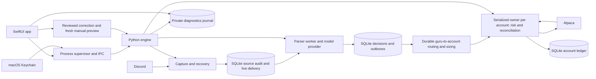

# Architecture

CopyTrading has a native SwiftUI app (`app/`) and one local Python engine (`engine/`). The [PRD](PRD.md) is the target product contract; this page describes the current implementation. The [validation record](validation.md) distinguishes passing checks from app-level operation still awaiting proof.

## Ownership and delivery

- `sources/` validates Discord messages, keeps rejected and historical captures for audit, and commits each recovery page with its cursor. Historical captures never enter the live parser queue. Captured live mode is fixed before processing, so delay cannot reclassify it. Optional author filtering audits nonmatching messages.
- `parsing/` owns immutable routes, provider clients, freshness and UTC request budgets, bounded retry, typed decisions, and evidence grounding. A per-channel pending head blocks later messages on that channel. Accepted decisions, execution delivery, and notification intent commit together in SQLite. Model calls occur outside that transaction.
- `execution/` owns account risk, broker observations, order/lot state, external inventory, ownership incidents, and replay-safe ledger transitions. It is the one layered package: `domain/` (strict values and policy), `application/` (use cases and ports), `adapters/` (Alpaca, SQLite ledger, the per-account owner), and `presentation/` (notifications and operator account views). One owner per account serializes the synchronous trading core and reconciles uncertain broker effects. Existing holdings stay separate from app-owned lots. Each copied buy becomes a lot keyed by its buy order and tied to the post that triggered it. The owner sells a lot by previewing it against a fresh quote (a market order in regular hours, a limit at the quote outside them) and confirming once through the guarded manual submit path; the sale is recorded under the buy's post, and a sale the broker never saw becomes uncertain instead of being sent again. Ambiguous ownership changes require an explicit, conserved allocation that cannot move external shares into app lots.
- `trading/` routes accepted signals to accounts and serves the operator. It is layered like `execution/`: `domain/` (configuration, source profiles, status), `application/` (account supervisors and the `OperatorQueryService`, `ManualInterventionService`, and `ProfileReviewService` use cases), `adapters/` (SQLite evidence and routing, Telegram, capability probes, telemetry, activation journal), `presentation/` (operator views), and `entrypoints/` (`TradingRuntime`, which owns the Start/Pause/shutdown lifecycle and drives the capture, parse, and account loops). Use cases reach accounts through `AccountAccess` and retained evidence through the `OperatorEvidence` port. An account that cannot be read is listed as unavailable with its reason; it is never shown as empty.
- `control/` serves agents and scripts through the `copytrading` CLI and MCP server. It is a flat package: `wire` (the versioned contract and JSON Schema), `policy` (tiers, access levels, rate window), `proposals` (owner-approved proposals and their limits), `views` (engine results presented without broker identities), and `service`, plus the I/O modules `sqlite` (the `control_audit` table), `client`, `cli`, and `mcp_server`. The client-side modules may import only the contract, so the CLI and MCP never load engine internals. See [agent control](agent-control.md).
- `assistant/` runs the in-app assistant: a Pydantic AI agent over the saved interpreter's model, with one tool per control request (read, pause, propose) handled by `ControlService` and audited as agent requests from the caller "CopyTrading Assistant", two read-only helpers (`guru_record`, `explain_skip`), a bounded in-memory conversation, and streamed turns the app polls. Only `agent.py` imports `pydantic_ai`. It forgets everything on lock.
- `host/` is the app-facing process boundary: the pipe server (four caller-task protocols), engine status, installation identity with the single-engine lock, and the credential-free engine self-test used by runtime and diagnostics acceptance harnesses.
- `diagnostics/` owns capture health, redaction, and the private diagnostics journal: one redacted JSON line per stage, captured payload, and trading outcome, kept by age and size. `backup/` owns verified backups, restore candidates, the fail-closed restore gate, and the schema catalog.
- `shared/` contains value contracts, workflow correlation, the payload-capture vocabulary, and the SQLite helpers. Each store exports one `SchemaComponent(name, revision, ddl)`; `application.db` (format version 3) holds the installation, self-test, parser, source, rejected-attachment, and routing components. SQLite uses WAL and explicit full synchronous durability. Source/parser handoffs use stable identity and acknowledge only after the next owner accepts; external sends can replay after interruption.
- `bootstrap.py` opens the installation before any store, then wires the services. The app owns process start/stop, UI state, and credentials entry; the engine owns durable operational decisions. `engine/tests/test_architecture.py` enforces allowed package dependencies, the flat-or-layered rule, I/O direction inside flat packages, and no cross-module private imports. The reasons are recorded in [architecture decision records](adr/).

The parser stores original source payloads, accepted signal evidence, diagnostics, and notification intents locally. The diagnostics journal is a private file the app reads directly; it never replaces operational SQLite. No Kafka, PostgreSQL, Iceberg, MinIO, Docker stack, or remote publisher backend is part of this repository's app runtime.

Each guru-to-account connection carries fixed or proportional sizing and an immutable accepted revision. A missing fraction uses an explicitly configured default or requires review. Account lifecycle preferences and manual-command identities survive restart. Corrected interpretations require a fresh preview and explicit confirmed command; uncertain submissions reconcile under the same identity before another attempt.

The app authenticates its window session through macOS and keeps authorized background processing independent of window visibility. Agents and scripts reach the engine through the `copytrading` CLI and MCP server: the app relays one `control` pipe operation, and the engine's `control` package applies tiers, limits and owner-approved proposals ([design](agent-control.md), [ADR-0005](adr/0005-agent-control-through-the-app.md)). Credentials reside in Keychain. The diagnostics journal lives under the installation's `logs/` directory, owner-only, and expires by whole UTC day and by a storage limit the owner chooses; operational evidence is never part of that retention. Capture gaps and journal health are visible in the app.

Restore uses isolated operational generations, manifest/schema checks, a durable startup gate, read-only broker evidence, and a native activation/rollback coordinator. Restored accounts remain disabled with manual recovery. User-initiated updates verify the artifact, atomically replace the app bundle, and retain recovery evidence until replacement startup succeeds. These flows are implemented and locally verified with the packaged runtime. Signed distribution and the remaining public-release gates are unqualified. See [operations](operations.md) and [validation](validation.md).

## Screens

| Place | Holds |
| --- | --- |
| Today | Today's change across accounts, intraday equity, what happened today, limit usage |
| Activity | Every post as a timeline; the inspector shows the message, what it was understood as, and each account's orders |
| People | Each guru you copy: their latest call, how their recent calls went, and which accounts copy them; gurus are added and edited here |
| Accounts | Balance, positions, limits, entries and recovery controls, account events; each position opens into the posts that bought it, and any lot can be sold; broker accounts are added here |
| Connections | Discord, the interpreter (any of 14 model services or an OpenAI-compatible address, its model, and key), and alerts |
| Getting Started | The setup guide, with a checklist that ticks itself as the setup fills in |
| Diagnostics | The engine's private log: captures, model requests and replies, trading outcomes, problems |
| Settings (⌘,) | A page with its own sidebar: General, Appearance, Updates, Engine, Agent Access, Backups, Logs |

Unsaved changes to Connections, People, and Accounts wait in one setup draft; a bar at the bottom of those screens checks it (Check Setup) and starts copying (Start Copying).

Toolbar on every screen: Paper or Live, a freshness indicator (press to refresh, ⌘R), Start / Pause Copying, Lock. ⌘1–⌘6 jump between screens.
The menu bar extra shows today's change and pauses or starts copying.
